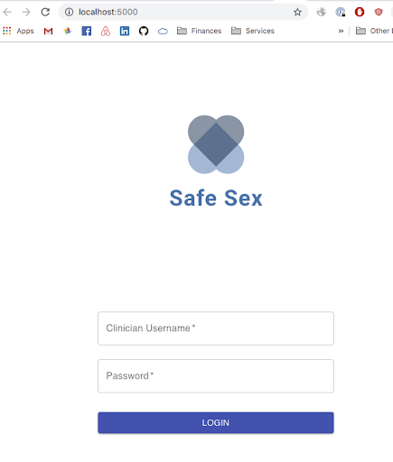
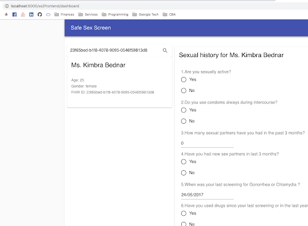
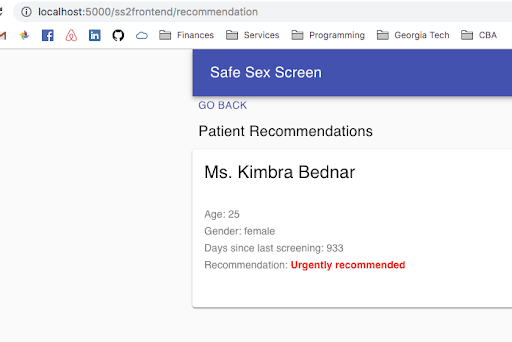

# SafeSEX Screen

## Overview

A web-based tool that generates screening recommendations for chlamydia and gonorrhea in sexually active women age 24 years and younger and in older women who are at increased risk for infection.

## Frontend

The following screenshots showcase the application's functionality and main pages:

### Login page

### Patient details

### Completed recommendation

## Backend

### Build and test locally

In order to build and test the backend container locally, follow the steps below:

1. Set your working directory to `<root>/backend`, where root is the name of the project root folder e.g. `SafeSEX-Screen-2`.
2. Run `make build` to build the image locally.
3. Run `make run` to run a local instance of the container, which maps port 80 to the container's internal port 80.
4. You can navigate to `http://localhost/ss2backend/health` and if you see the message "App is healthy!" the application is running as expected.

#### Unit tests

To run unit tests, follow the steps below:

1. If the container is not already running, run the `make run` command in the `backend` directory.
2. Execute `make test` after starting the container.
