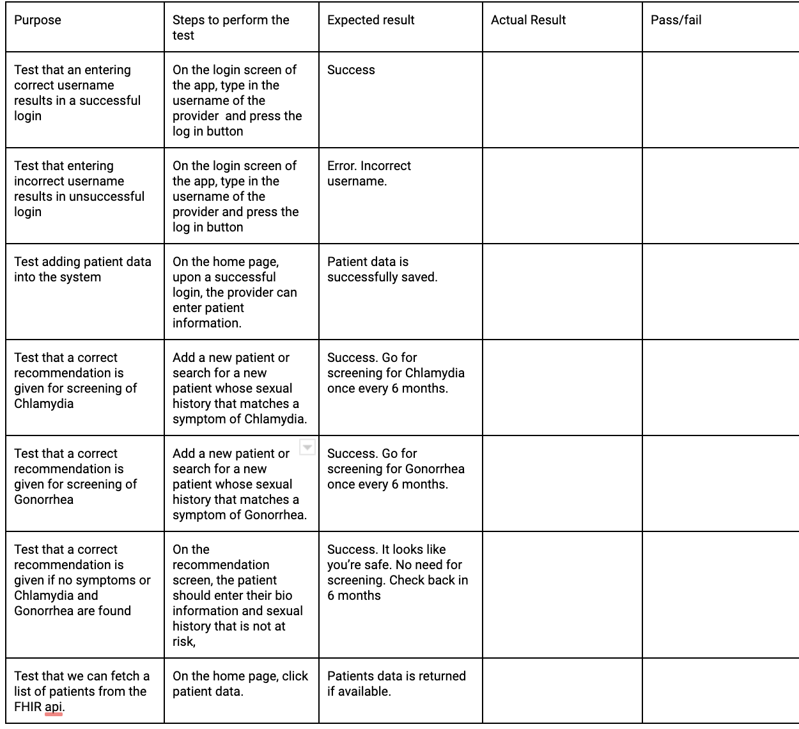

# Test Plan

**Author**: *Team Cranky Euler*

## 1 Testing Strategy

### 1.1 Overall strategy

Our testing will encompass unit and integration tests. Unit tests will mostly be for the backend functionality to ensure the core functional logic is implemented such as using patient-provided data to determine the risk level of Chlamydia or Gonorrhea. Integration tests will be used to test the whole system  as a whole once most of the functionality has been built in. For our unit tests, we will use chai and mocha Javascript libraries. The UI will mostly involve manual testing by the QA lead.

### 1.2 Test Selection

We will employ white box testing techniques in the project which will involve working with the source code. We will focus on independent testable features such as authentication, addition of patiient information and fetching recommendation details. We anticipate that most of our tests will be unit tests.

### 1.3 Adequacy Criterion

We will strive to achieve 70% test coverage as measured by tools such as Istanbul to test this coverage. 

### 1.4 Bug Tracking

We will track bugs by creating Github issues with label *bug* in our assigned Github repository. This will ensure visibility to the whole team as well as our TA.

### 1.5 Technology

We will use chai and mocha testing libraries for our unit tests. We hope to use Selenium for the test of our web application as well if time allows.
## 2 Test Cases

Preliminary test cases: 

